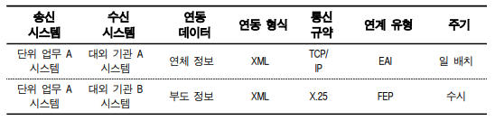

## 일학습병행제 외부테스트 내용 정리
- 합격 기준 : 11개의 능력단위 평가에 대한 것들 중 8개 이상 pass
- 각 평가 pass 기준 : 60/100점 이상
- 11개의 능력단위 들에 대한 평가유형, 분류는 [공개자료]SW개발_L5_ver.2.0.hwp 의 필수능력 단위 참조

## 1. 요구사항 확인 (면접)
1. 현행 시스템 분석하기
2. 요구사항 확인하기
3. 분석 모델 확인하기

### 1-1. 현행 시스템 분석하기
- 정의 : 기능, 다른 시스템들과 어떤 정보를 주고받는지, 기술요소, SW/HW, 네트워크 구성 등을 파악하는 활동
- 목적 : 향후 개발하고자 하는 시스템의 개발범위 및 방향성 설정

#### 1-1-1.현행 시스템 파악 절차 3단계
1. **구성/기능/인터페이스** 현황
  - 구성 현황 : 기간 업무 + 지원 업무. 각 업무에 해당하는 정보시스템 명칭, 기능 명시해서 조직 내 존재하는 모든 정보시스템 현황 파악
  - 기능 현황 : 현재 제공하고 있는 기능(계층형으로 작성 - 주요 기능, 하부 기능)
  - 인터페이스 현황 : 단위 업무 시스템이 다른 단위 업무 시스템과 주고받는 데이터 종류, 형식, 프로토콜 등등을 명시한 것 (ex XML, EAI, TCP/IP, FEP..)

정보시스템 구성 현황 예시 

정보시스템 기능 구성도 예시 

인터페이스 구성도 예시 

2. **아키텍처, 소프트웨어** 구성 현황
  - 아키텍처 구성도 : 어떠한 기술 요소들을 사용하고 있는지 최상위 수준에서 그림으로 표현한 것
  - 소프트웨어 구성도 : 제품명, 용도, 라이선스 적용 방식 (MySQL/DB/GPL)

아키텍처 구성도 예시 

소프트웨어 구성도 예시 

3. **하드웨어, 네트워크** 구성 현황
  - 하드웨어 구성도 : 시스템별 서버의 주요 사양 (AP 서버 - IBM XXX - 4코더, 메모리 16GB, HDD 500GB - 수량 N개 - 이중화 X)
  - 네트워크 구성도 : 시스템 간 어떠한 네트워크 구성을 갖고 있는지 표현한 것 (전산 센터, IDC)

하드웨어 구성도 예시 

네트워크 구성도 예시 
